# PM² by Playing It

**The European Commission's PM² methodology, taught as a playable case study.**
Two complete projects — a waterfall one and an agile one — set inside a fictional
European Stability Mechanism, with 77 scenes, 1,945 lines of dialogue, all 33 PM²
artefacts filled in with real case content, 550 exam questions, and 8 hours of
recorded voice acting.

<p align="center">
  <a href="https://rhycha.github.io/PM-in-ESM-Role-Playing-Game/"><b>▶ Play it in your browser</b></a>
  &nbsp;·&nbsp;
  <a href="#what-is-in-here">What is in here</a>
  &nbsp;·&nbsp;
  <a href="#for-pm-candidates">For PM² candidates</a>
  &nbsp;·&nbsp;
  <a href="#how-it-was-built">How it was built</a>
</p>

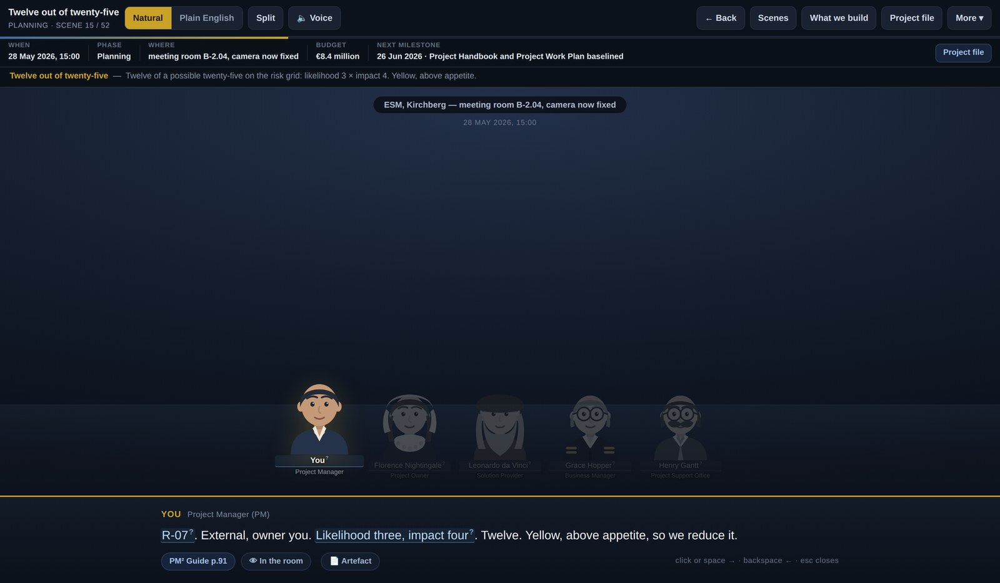

---

> ### Please read this first
>
> **The projects are fictional.** The European Stability Mechanism is a real institution
> and the institutional facts here are accurate, but *Project CASTOR*, *Project POLLUX*,
> their people, budgets, dates and figures are entirely invented for teaching. Nothing
> here describes a real ESM project, a real ESM system, or a real ESM employee.
>
> **The characters are historical figures used as memory aids.** Each one holds a modern
> job chosen so that the thing they are famous for *is* the thing their PM² role does —
> Florence Nightingale owns the outcome, Leonardo cannot stop refining the deliverable,
> Grace Hopper translates between business and machine. They are mnemonics, not portrayals.
> Nothing any of them says reflects the real person's views.
>
> **This is a study project, not a credential.** It was built while preparing for the
> PM² Advanced and PM²-Agile certification exams. It does not confer, replace or represent
> any certification.

---

## Why this exists

I set out to pass two European Commission certifications — **PM² Advanced** and
**PM²-Agile** — and hit the problem every candidate hits: the official guide is 148 pages
of correct, precise, entirely abstract prose. It tells you the Project Owner is
*accountable* for the Business Case and the Business Manager is *responsible* for it.
It never shows you the meeting where those two people disagree about what that means.

So I built the meeting.

Every rule in the guide is dramatised as a decision somebody has to make, in a room,
under a deadline, with the artefact open on the table. You do not read that a risk which
materialises stops being a risk and becomes an issue — you are in the room on
4 October 2027 when the architect resigns, and you watch R‑07 move from the Risk Log
to the Issue Log while the Solution Provider argues that it was always going to happen.

## What is in here

| | | |
|---|---|---|
| **Project CASTOR** | 52 scenes · 1,318 lines · 31 decisions | The full PM² lifecycle — Initiating, Planning, Executing, Closing, all three phase gates, all 13 Monitor & Control processes |
| **Project POLLUX** | 25 scenes · 627 lines · 14 decisions | PM²‑Agile as the sequel: same institution, same people, built on what CASTOR delivered |
| **Artefact Atlas** | 33 artefacts · 708 fields | Every official PM² artefact as a structure diagram, each field explained and filled with case content |
| **Agile Atlas** | 42 entries | The model, the five ceremonies, the agile artefacts, the four roles, and the themes |
| **Revision dashboards** | 550 questions | 300 PM² + 250 PM²‑Agile, each with the guide page it comes from; timed mocks, a RASCI drill, weak-topic practice |
| **Recorded voice** | 8 h 12 min · 4,250 clips | Every line spoken, in two scripts — the natural dialogue and a Plain English rewrite |

### The story, with the artefact beside it

The split view keeps the document open next to the conversation. As each line is spoken,
the exact field being discussed lights up. Here the Project Manager is scoring risk R‑07,
and the Risk Log entry is highlighted in the pane on the right.

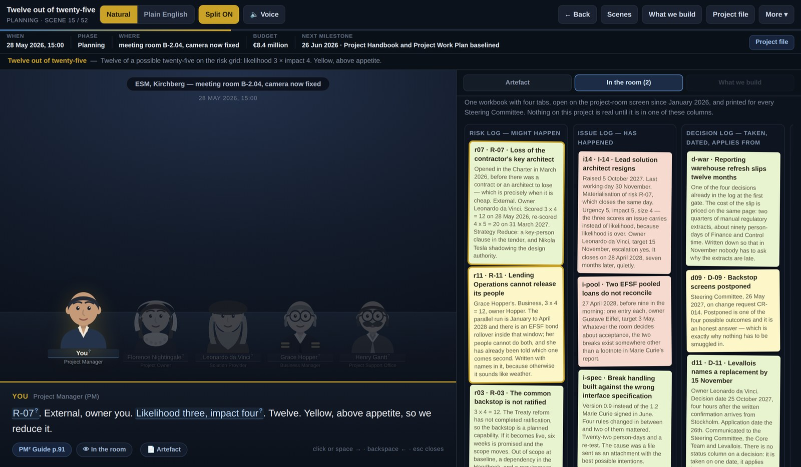

### Every figure is explained

Dialogue is full of numbers — *"likelihood three, impact four, twelve"*, *"the twenty-sixth"*,
*"R‑07"*, *"nine of eleven"*. Each one is clickable and says what it actually means, in
plain English. 856 figures, dates, identifiers and thresholds are annotated this way.

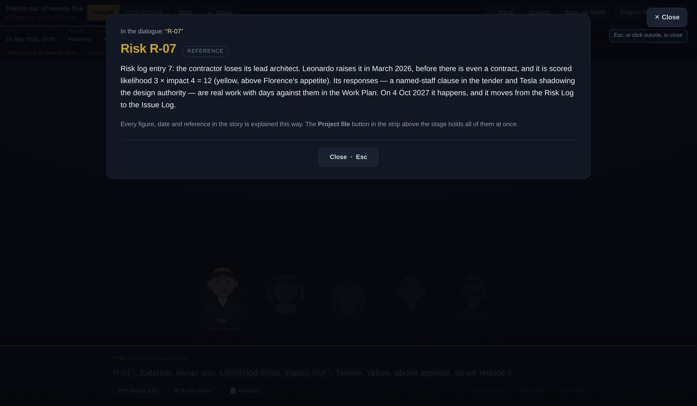

### A project file that never leaves you

Budget, effort, the five success criteria, the full timeline, who is who, and how the
scoring conventions work — one keystroke away at any point in the story.

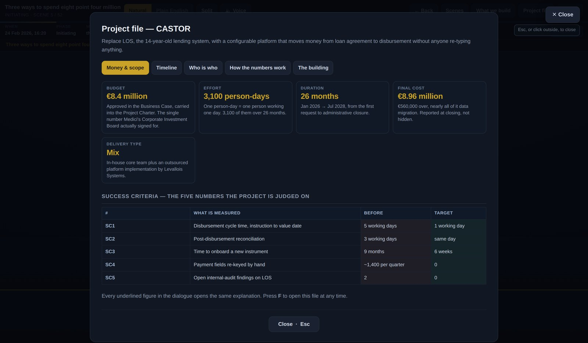

### What the project is actually building

Project management stops being abstract when you can see the thing being managed.
Twenty diagrams cover the system itself: the old lending platform and its manual
re-keying, the target architecture, one disbursement end to end, the four-eyes payment
control, the data model, the release train, the migration.

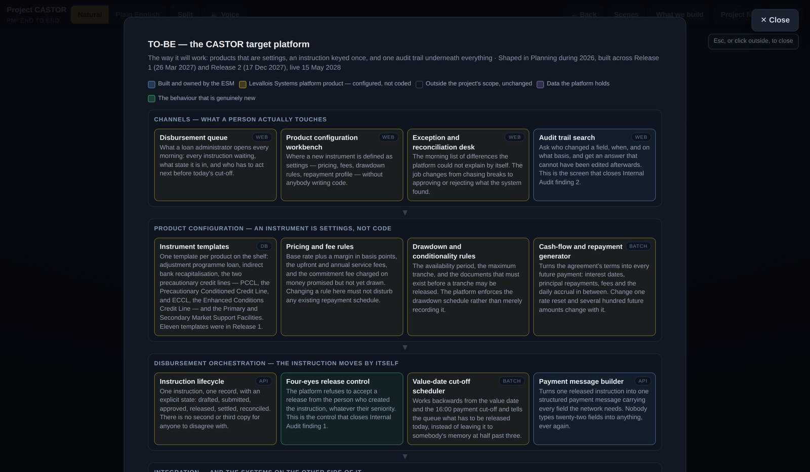

Including the screens the whole project is about.

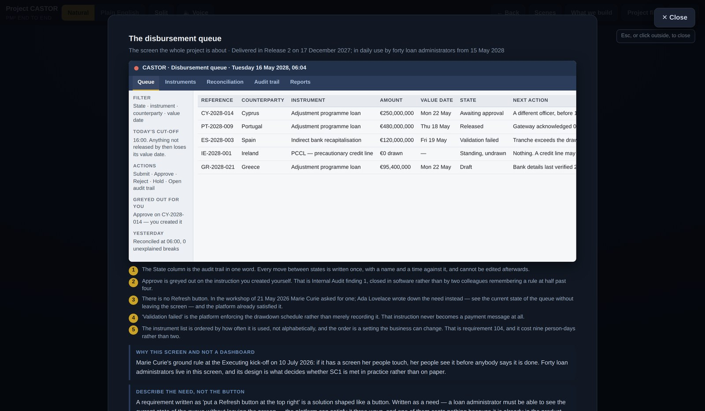

### In the room

Characters constantly refer to objects — a wall of principles, a spreadsheet tab, a
whiteboard, a burn-down on the screen. Forty-six of those objects are drawn, and the
line being spoken points at the exact item.

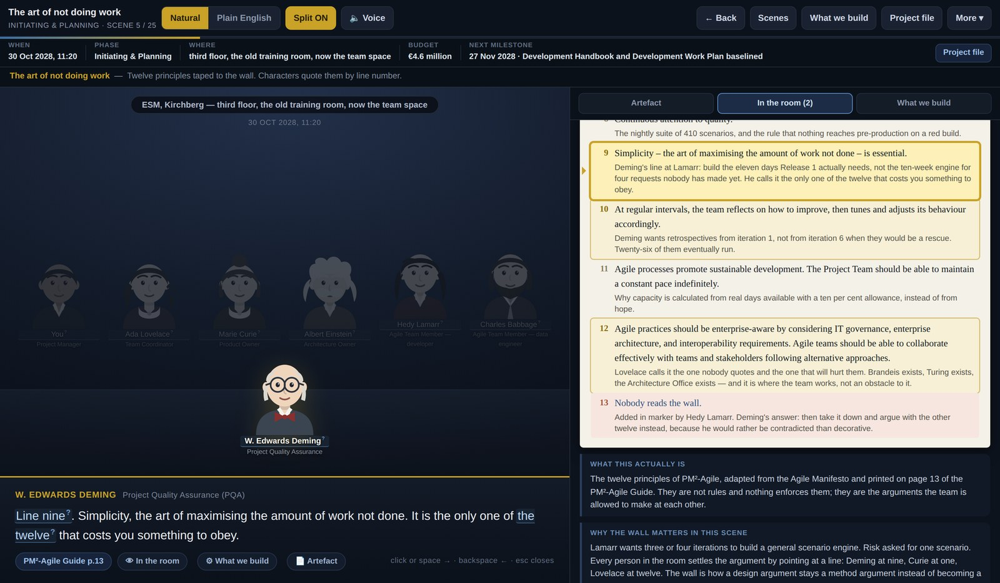

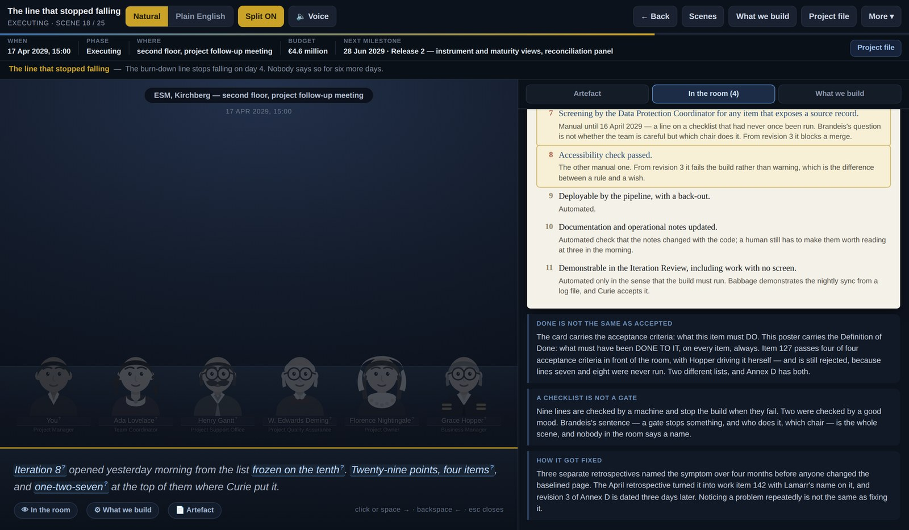

### The artefacts, filled in

Every field of every artefact, with what it is for, who owns it, and the same field
completed with case content.

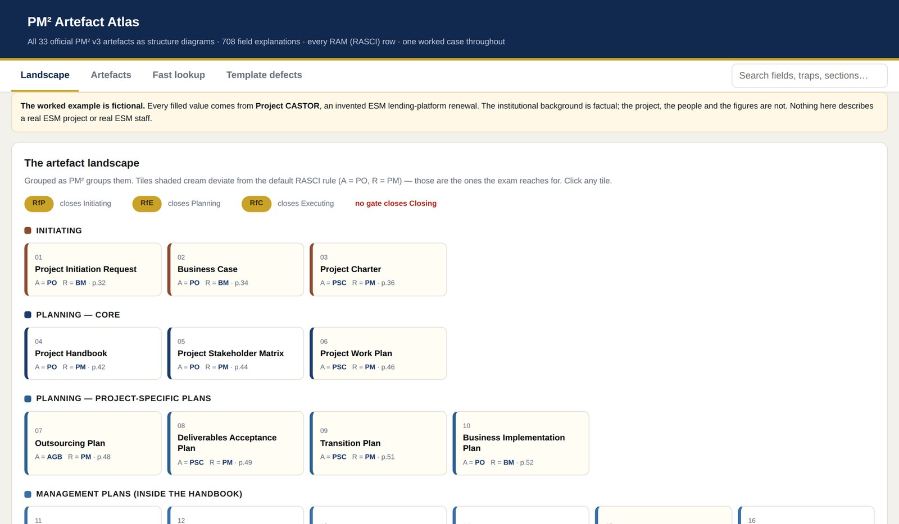

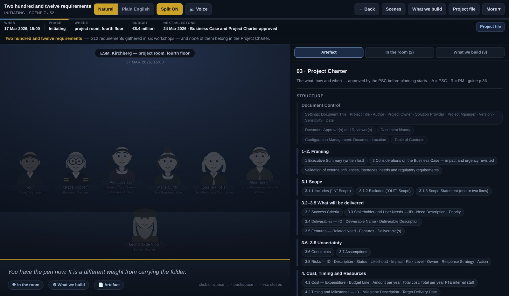

### Decisions, marked against the guide

At the turning points you choose. The verdict cites the page.

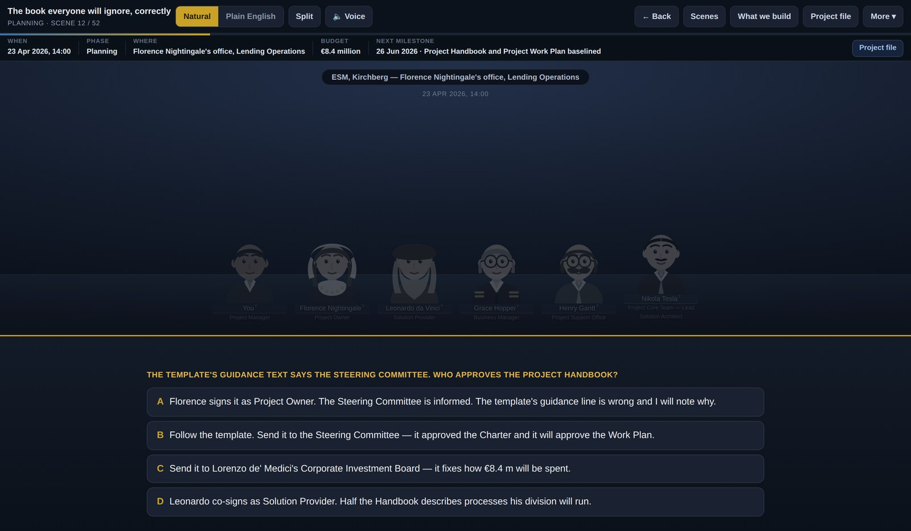

### The revision side

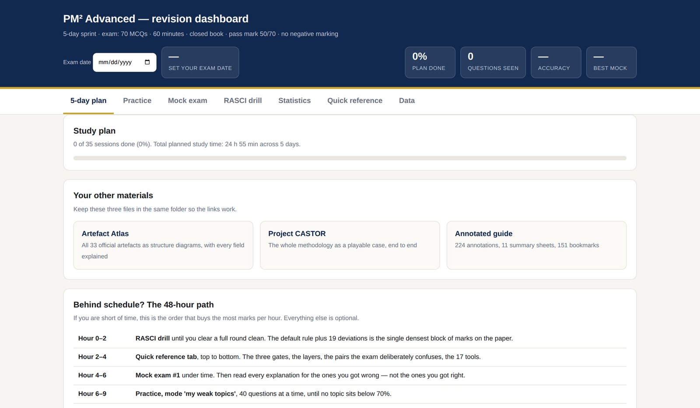

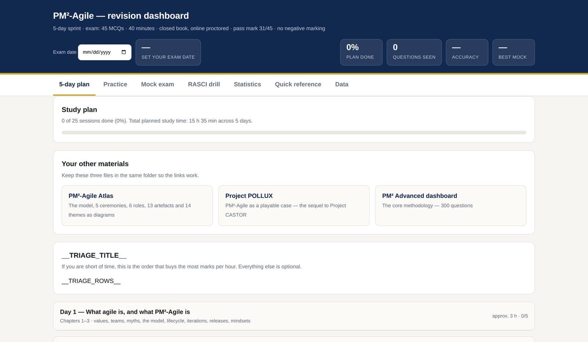

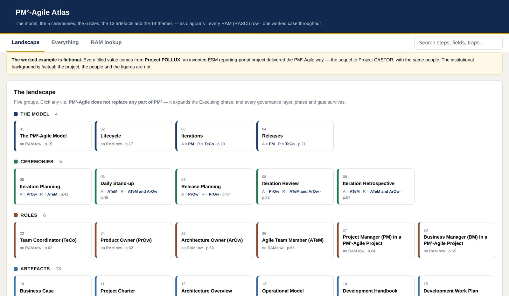

### Coverage, tracked

Every activity and artefact the guide prescribes, and the scene where you met it.

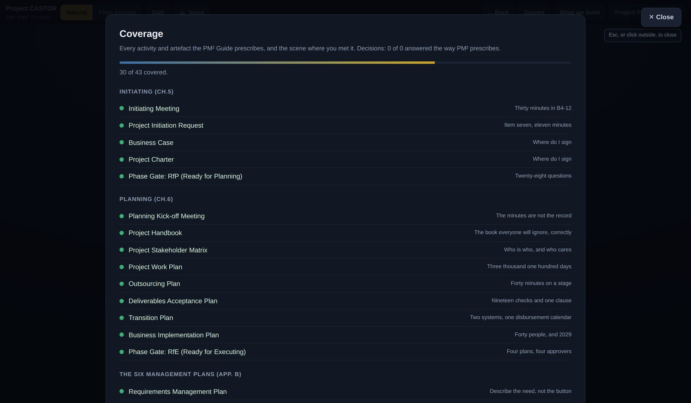

### The cast

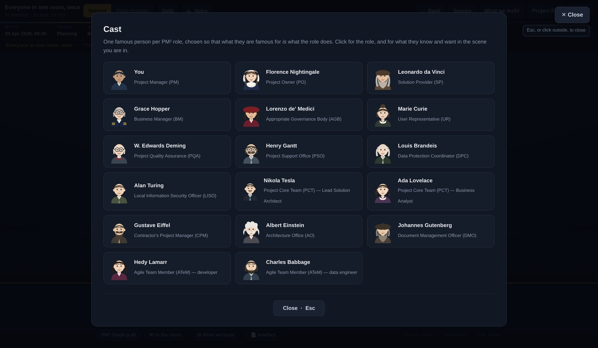

---

## For PM² candidates

This is free, offline, and yours to use. Nothing phones home; progress is saved in your
own browser.

**If you have five days**, start at `play/03_Dashboard_EN.html` and follow the plan.
**If you have forty-eight hours**, the dashboard has a shorter path that says which
two hours buy the most marks.

What it covers against the syllabus:

- All four phases and all three phase gates (RfP, RfE, RfC)
- All 33 artefacts, each with its RASCI row rendered as a readable table rather than a
  string of letters
- All 13 Monitor & Control processes
- The six Management Plans and how they are tailored
- The full PM²-Agile model: CIR cycle, the five ceremonies, the four agile roles, the
  Development Handbook and Work Plan, and what agile does *not* remove
- The RASCI default rule plus all 19 deviations — the densest block of marks on the paper

Every question carries the guide page it comes from, so a wrong answer sends you to a
page rather than to a shrug. The 300 PM² questions were verified against the guide
page by page; the 250 agile questions likewise.

**One honest caveat.** Question banks are written by a candidate, not by the certifying
body. Use them to find gaps, then confirm against the official guide, which is free from
the European Commission. Do not trust anything here over the guide itself.

---

## For a reader from the ESM

If you are looking at this because of an application, here is what it is evidence of,
stated plainly.

**Domain.** The case is built on how the ESM actually works: the toolkit (stability
support loan, bank recapitalisation, PCCL, ECCL, PMSF, SMSF, and the planned common
backstop to the Single Resolution Fund), funding by bond and bill issuance, the Board of
Governors and Board of Directors, and the fact that a disbursement is a value date with a
cut-off, not a bank transfer. The invented project — replacing a fourteen-year-old
lending operations system to get straight-through processing from loan agreement to
disbursement — is invented, but it is the kind of thing that would be real, and the
success criteria are the kind that would be argued over.

**Method.** Not a summary of PM². Every artefact, every gate, every process, applied to
one case with consistent figures across all of them. The RASCI tables are machine-parsed
from the guide's own appendix, and where the official templates and the guide text
disagree — nineteen places, including one artefact missing from the template pack — the
disagreements are documented rather than smoothed over.

**Delivery.** Roughly 15,000 lines of hand-written HTML, CSS and JavaScript; a Python
build pipeline; six self-contained deliverables that run offline from a file with no
server, no framework and no dependencies; 4,250 audio clips rendered locally with an
open-source model and assembled into seek-indexed sprites.

**How I work with AI.** This was built with Claude as a pair, and that is the point rather
than a disclaimer. The interesting part was not generating text — it was the verification
loop: adversarial review passes that caught wrong answer keys and over-claiming
explanations, measurement instead of assumption when the audio sounded wrong (43% of clips
had dead gaps over 0.3 seconds; the fix was diagnosed from the waveform, not guessed), and
a discipline of never letting generated content into a deliverable without a check that
could fail. If the role involves applying AI to project delivery, this repository is a
worked example of the parts that actually matter: grounding, verification, and knowing
which claims you are allowed to make.

**Where I am on the certification.** I have not sat the exams yet. I am sitting
PM² Advanced and PM²-Agile shortly, and this is what I built to prepare. I would rather
show the preparation than claim the certificate.

---

## Running it

Nothing to install. Open any file in `play/` in a browser.

```bash
git clone https://github.com/rhycha/PM-in-ESM-Role-Playing-Game.git
cd PM-in-ESM-Role-Playing-Game
open play/03_Dashboard_EN.html      # macOS · use `xdg-open` on Linux, `start` on Windows
```

Or use the [live version](https://rhycha.github.io/PM-in-ESM-Role-Playing-Game/).

**Voice.** The `play/voice/` folder holds the recorded audio; the story pages find it
automatically when they sit beside it. Turn it on with the 🔊 button, or press `V`.
Without it, the pages fall back to your browser's own speech synthesis.

**Keys.** `space` advance or pause · `←` back · `P` plain English · `V` voice ·
`F` project file · `R` in the room · `Esc` close

---

## How it was built

```
play/     the six deliverables — self-contained HTML, no dependencies
src/      the content as data: artefacts, scenes, questions, solution diagrams,
          props, the number registry, the case bibles
tools/    the build pipeline and the voice renderer
          voice/ — 16 MP3 sprites, 8 h 12 min, seek-indexed, loaded automatically
docs/     case bibles and the screenshots in this README
```

Content lives as JSON and is compiled into the HTML by `tools/build_html.py`, so the
prose, the artefact data and the presentation stay separable.

**Regenerating the voice** — the audio is committed, but it can be rebuilt from scratch:

```bash
pip install piper-tts numpy pillow requests
curl -LO https://github.com/rhasspy/piper/releases/download/v0.0.2/voice-en-us-libritts-high.tar.gz
tar xf voice-en-us-libritts-high.tar.gz
python3 tools/make_voices.py       # ~3 h on two cores; resumable
```

Numbers are normalised to words before synthesis, each sentence is rendered separately
and joined with a fixed pause, and silences are trimmed — which is why nothing breaks in
the middle of a figure.

**Portraits** — the cast is drawn as generated SVG. `tools/get_portraits.py` will replace
them with public-domain photographs from Wikimedia Commons; it checks each file's licence
through the Commons API and refuses anything not public domain or CC, then writes a
credits file.

---

## Licence and attribution

- **Code and original content** (`play/`, `src/`, `tools/`, `docs/`) —
  see [LICENCE](LICENCE). Code is MIT; the written case material is CC BY-NC 4.0.
- **Recorded voice** — synthesised with [Piper](https://github.com/rhasspy/piper) (MIT)
  using the LibriTTS-R multi-speaker model (CC BY 4.0). See
  [NOTICE.md](NOTICE.md) for full attribution.
- **The PM² Guide** is published by the European Commission and is not redistributed
  here. Page citations point at the official edition, which is
  [free to download](https://commission.europa.eu/about/departments-and-executive-agencies/digital-services/pm2-project-management-methodology_en).
- This project is **not affiliated with, endorsed by, or connected to** the European
  Commission, the European Stability Mechanism, or any certifying body.

Corrections are welcome — particularly if you find a question whose key or page reference
is wrong. Open an issue.
